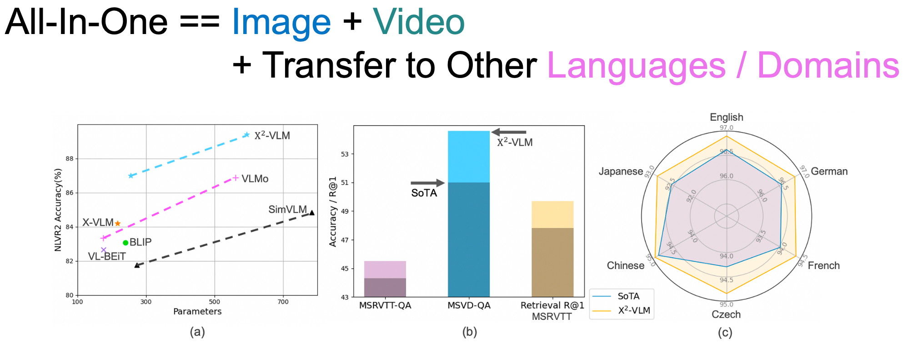

# X<sup>2</sup>-VLM: All-In-One Pre-trained Model For Vision-Language Tasks

<div align="center">
  
</div>

X<sup>2</sup>-VLM with a modular architecture performs the best on base and large scale for both image-text and video-text tasks, making a good trade-off between performance and model scale. We also show that the modular design of X<sup>2</sup>-VLM results in high transferability for X<sup>2</sup>-VLM to be utilized in any language or domain. For example, by simply replacing the text encoder with XLM-R, X-VLM outperforms state-of-the-art multilingual multi-modal pre-trained models without any multilingual pre-training. 


- Jun 2023: Release official PyTorch implementation and checkpoints
- Nov 2022: Release preprint in arxiv. 


X<sup>2</sup>-VLM (large, 593M params): 
[](https://paperswithcode.com/sota/cross-modal-retrieval-on-flickr30k?p=x-2-vlm-all-in-one-pre-trained-model-for)
[](https://paperswithcode.com/sota/cross-modal-retrieval-on-coco-2014?p=x-2-vlm-all-in-one-pre-trained-model-for)
[](https://paperswithcode.com/sota/visual-grounding-on-refcoco-testa?p=x-2-vlm-all-in-one-pre-trained-model-for)
[](https://paperswithcode.com/sota/visual-reasoning-on-nlvr2-test?p=x-2-vlm-all-in-one-pre-trained-model-for)
[](https://paperswithcode.com/sota/visual-question-answering-on-vqa-v2-test-std?p=x-2-vlm-all-in-one-pre-trained-model-for)


## Features
- Support several backbones 
    - vision encoder: beit / clip-vit / swin-transformer 
    - text encoder: bert / roberta
- Support apex O1 / O2 for pre-training
- Read from and write to HDFS
- Distributed training across nodes for both pre-training and fine-tuning

Please read the code for more details. 


## Requirements
- Install python3 environment
```angular2html
pip3 install -r requirements.txt
```
- Download raw images from corresponding websites
- Download the json files we provided, which contains image read paths and captions and/or bbox annotations
- If running pre-training scripts: 
  - install Apex
  - download pre-trained models for parameter initialization 
    - image encoder: beit2 
    - text encoder: bert 


## Pretrain
```angular2html
# X-VLM pretrain 
python3 run.py --task "pretrain_DIY" --dist "all" --config "configs/pretrain/x2vlm_base_4m.yaml"  --output_dir "output/tmp"

# CCLM multilingual multimodal pretrain 
python3 run.py --task "pretrain_DIY" --dist "all" --config "configs/pretrain/multilingual_cclm_x2vlm_base.yaml" --checkpoint "path/to/x2vlm_base_1b.th"  --output_dir "output/tmp"
```
See run.py and configs/pretrain for more details.


#### Data
All datasets we utilized are public available. Please prepare the pre-training data by yourself. Read the code dataset/pretrain_dataset.py (more specifically ImageTextJsonDataset & RegionTextJsonDataset) to see what format is needed. 

The processed COCO & VG annotations can be downloaded [here](https://drive.google.com/drive/u/1/folders/1W4_wr53DDWLsvuSavNW1iDbSo9yXQQL1).


#### Checkpoints
Please make sure all parameters are loaded correctly.   
[X2VLM-base (4M)](https://lf-robot-opensource.bytetos.com/obj/lab-robot-public/x2vlm_ckpts_2release/x2vlm_base_4m.th)    
[X2VLM-large (4M)](https://lf-robot-opensource.bytetos.com/obj/lab-robot-public/x2vlm_ckpts_2release/x2vlm_large_4m.th)    
[X2VLM-base (1B)](https://lf-robot-opensource.bytetos.com/obj/lab-robot-public/x2vlm_ckpts_2release/x2vlm_base_1b.th)  
[X2VLM-large (1B)](https://lf-robot-opensource.bytetos.com/obj/lab-robot-public/x2vlm_ckpts_2release/x2vlm_large_1b.th)   
[CCLM-X2VLM-base](https://lf-robot-opensource.bytetos.com/obj/lab-robot-public/x2vlm_ckpts_2release/cclm_x2vlm_base.th)  
[CCLM-X2VLM-large](https://lf-robot-opensource.bytetos.com/obj/lab-robot-public/x2vlm_ckpts_2release/cclm_x2vlm_large.th)


## Finetune

#### Data
All datasets are publicly available. Some datasets can be downloaded [here](https://drive.google.com/file/d/1XFz1Vtz7MCBLn4_1QEojhFJ5Iw3eH3X4/view?usp=sharing).  


#### Checkpoints, Configs and Logs
We have released all codes. However, now we only provide parts of fine-tuned ckpts (and training configs and logs).   
[vqa-base](https://lf-robot-opensource.bytetos.com/obj/lab-robot-public/x2vlm_ckpts_2release/x2vlm_base_1b_vqa.th)    
[vqa-large](https://lf-robot-opensource.bytetos.com/obj/lab-robot-public/x2vlm_ckpts_2release/x2vlm_large_1b_vqa.th)  
[captioning-large](https://lf-robot-opensource.bytetos.com/obj/lab-robot-public/x2vlm_ckpts_2release/x2vlm_large_1b_captioning.tar)   
[refcoco-bbox-large](https://lf-robot-opensource.bytetos.com/obj/lab-robot-public/x2vlm_ckpts_2release/x2vlm_large_1b_grounding.tar)  
It takes time for us to retrieve our previous training logs. If you need more, please submit a Github issue and we will return to your request later.   
[coco-retrieval-base-rerun](https://lf-robot-opensource.bytetos.com/obj/lab-robot-public/x2vlm_ckpts_2release/xvlm_beit_1b_stage2_coco_rerun.th)    
[coco-retrieval-large-rerun](https://lf-robot-opensource.bytetos.com/obj/lab-robot-public/x2vlm_ckpts_2release/xvlm_beit_1b_large_stage2_coco_rerun.th)


#### Examples
```angular2html
# train

python3 run.py --task "vqa" --dist "all" --config "configs/finetune/vqa2_large.yaml" --checkpoint "x2vlm_ckpts_2release/x2vlm_large_1b.th"  --output_dir "output/tmp"

python3 run.py --task "refcoco_bbox" --dist "all" --config "configs/finetune/refcoco_grounding_large.yaml" --checkpoint "x2vlm_ckpts_2release/x2vlm_large_1b.th"  --output_dir "output/tmp"

python3 run.py --task "coco_captioning_mlm" --dist "all" --config "configs/finetune/coco_captioning_large.yaml" --checkpoint "x2vlm_ckpts_2release/x2vlm_large_1b.th"  --output_dir "output/tmp"
```
We release all training codes. Specify "--task" and "--config" to finetune on other tasks. See run.py for details.


## Citation
If you find this repository useful, please considering giving ⭐ or citing:
```
@article{zeng2022x,
  title={X $\^{} 2$-VLM: All-In-One Pre-trained Model For Vision-Language Tasks},
  author={Zeng, Yan and Zhang, Xinsong and Li, Hang and Wang, Jiawei and Zhang, Jipeng and Zhou, Wangchunshu},
  journal={arXiv preprint arXiv:2211.12402},
  year={2022}
}

@article{zeng2022cross,
  title={Cross-view language modeling: Towards unified cross-lingual cross-modal pre-training},
  author={Zeng, Yan and Zhou, Wangchunshu and Luo, Ao and Zhang, Xinsong},
  journal={arXiv preprint arXiv:2206.00621},
  year={2022}
}

@article{xvlm,
  title={Multi-Grained Vision Language Pre-Training: Aligning Texts with Visual Concepts},
  author={Zeng, Yan and Zhang, Xinsong and Li, Hang},
  journal={arXiv preprint arXiv:2111.08276},
  year={2021}
}
```


### Contact
For issues using this code, please submit a GitHub issue.